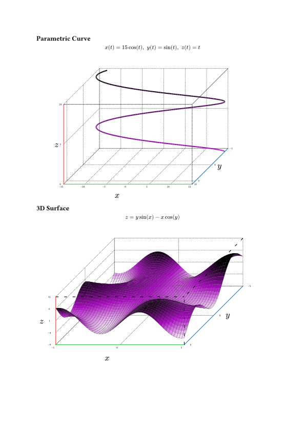
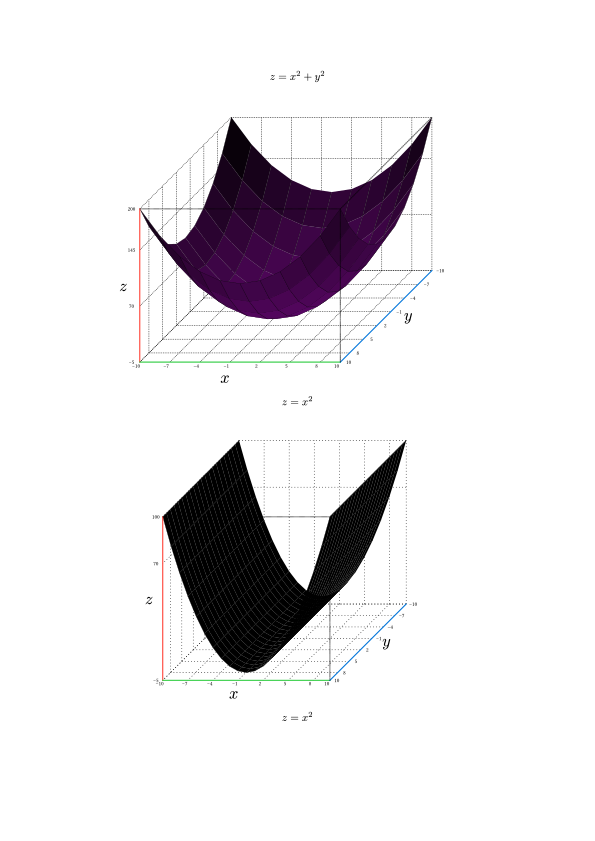
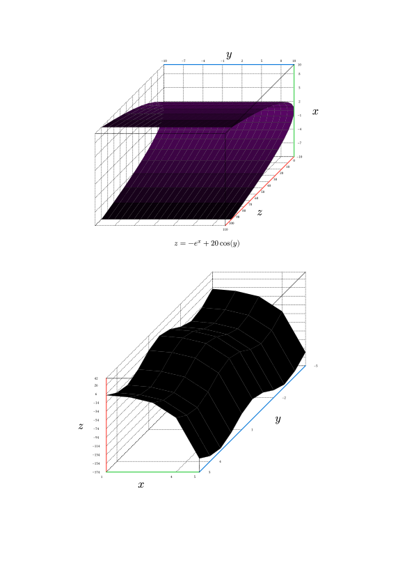
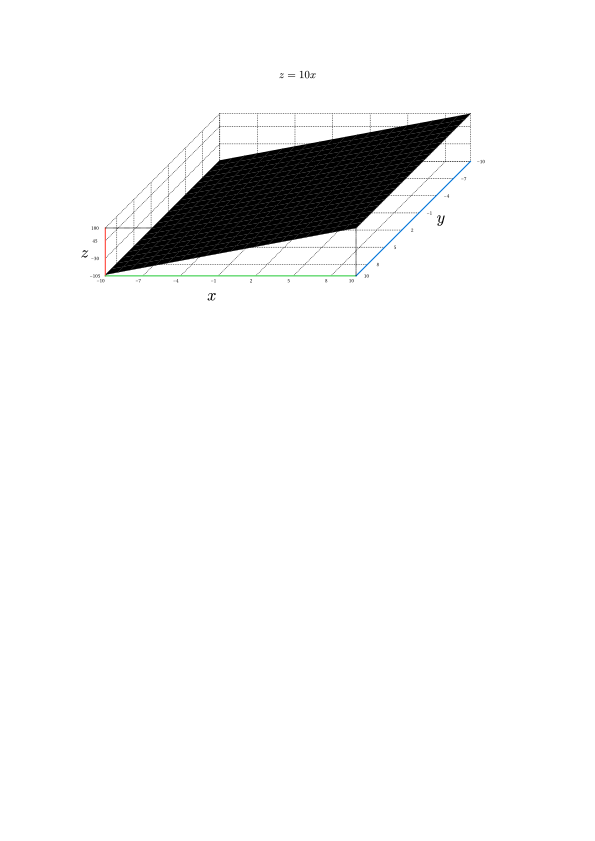

# The `plotsy-3d` Package
<div align="center">Version 0.1.0</div>

**plotsy-3d** is a [Typst](https://github.com/typst/typst) package for rendering 3D objects built on top of [CeTZ](https://github.com/cetz-package/cetz). Similar functionality to pgfplots for LaTeX but currently less developed.

Will be released on typst universe at some point but is not yet* so need to use `#import "plotsy-3d.typ": *` and have the `plotsy-3d.typ` file in your project folder.


## Features:

* 3D surface plotting of the form `z = f(x,y)` over a square region
* 3D parametric curve plotting with inputs `x(t), y(t), z(t)`

See **Usage** or `Examples/examples.typ` for the code
<h1 align="center">
  
</h1>


## Future Plans (contributors welcome):
- [ ] Vector Field Plotting
- [ ] Surface plotting over non square regions
- [ ] User Manual
- [ ] Make the code nicer

## Usage

A more in-depth description of usage. Any template arguments? A complicated example that showcases most if not all of the functions the package provides? This is also an excellent place to signpost the manual.
### Parametric Function Plotting
```typ
#import "plotsy-3d.typ": *

#let xfunc(t) = 15*calc.cos(t)
#let yfunc(t) = calc.sin(t)
#let zfunc(t) = t

#plot_3d_parametric_curve(
    xfunc,
    yfunc,
    zfunc,
    subdivisions:30,
    scale_dim: (0.03,0.05,0.05),
    tdomain:(0,10),
    axis_step: (5,5,5),
    dot_thickness: 0.05em,
    front_axis_thickness: 0.1em,
    front_axis_dot_scale: (0.04, 0.04),
    rear_axis_dot_scale: (0.08,0.08),
    rear_axis_text_size: 0.5em,
    axis_label_size: 1.5em,
    rotation_matrix: ((-2, 2, 4), (0, -1, 0)) 
)
```

### 3D Surface Plotting
```typ
#import "plotsy-3d.typ": *

#let size = 5
#let scale_factor = 0.3x
#let (xscale,yscale,zscale) = (0.3,0.3,0.05)

#let func(x,y) = y*calc.sin(x) -x*calc.cos(y) 
#let color_func(x, y, z, x_lo,x_hi,y_lo,y_hi,z_lo,z_hi) = {
  return purple.transparentize(20%).darken((z/(z_hi - z_lo)) * 300%)
}

#plot_3d_surface(
    func,
    color_func: color_func,
    subdivisions: 5,
    subdivision_mode: "increase",
    scale_dim: (xscale*scale_factor,yscale*scale_factor, zscale*scale_factor),
    xdomain: (-size,size),
    ydomain:  (-size,size),
    pad_high: (0,0,2),
    pad_low: (0,0,0),
    axis_label_offset: (0.2,0.1,0.1),
    axis_text_offset: 0.045,
)
```

## More Examples

<h1 align="center">
  
  
  
</h1>


## Star History

<a href="https://star-history.com/#misskacie/plotsy-3d&Date">
 <picture>
   <source media="(prefers-color-scheme: dark)" srcset="https://api.star-history.com/svg?repos=misskacie/plotsy-3d&type=Date&theme=dark" />
   <source media="(prefers-color-scheme: light)" srcset="https://api.star-history.com/svg?repos=misskacie/plotsy-3d&type=Date" />
   
 </picture>
</a>
[](https://star-history.com/#misskacie/plotsy-3d&Date)
