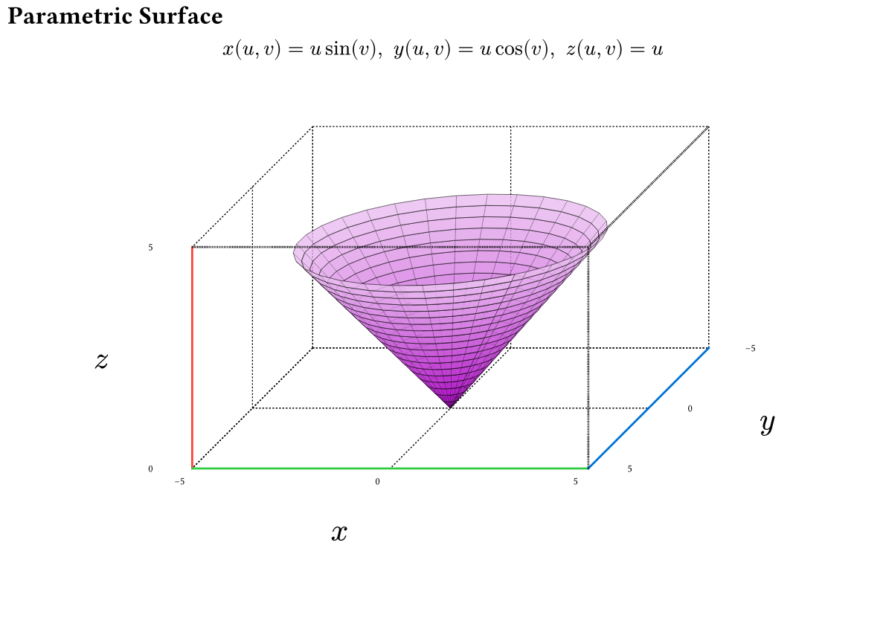
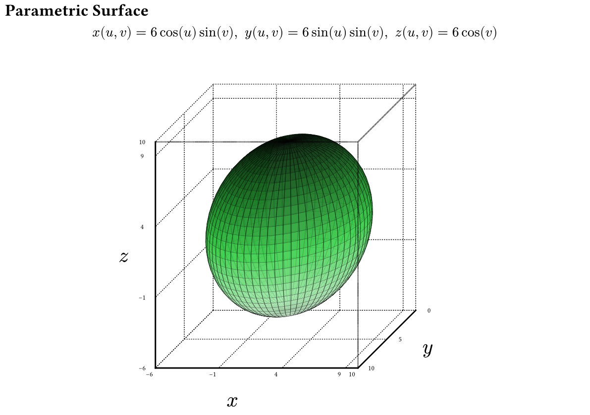
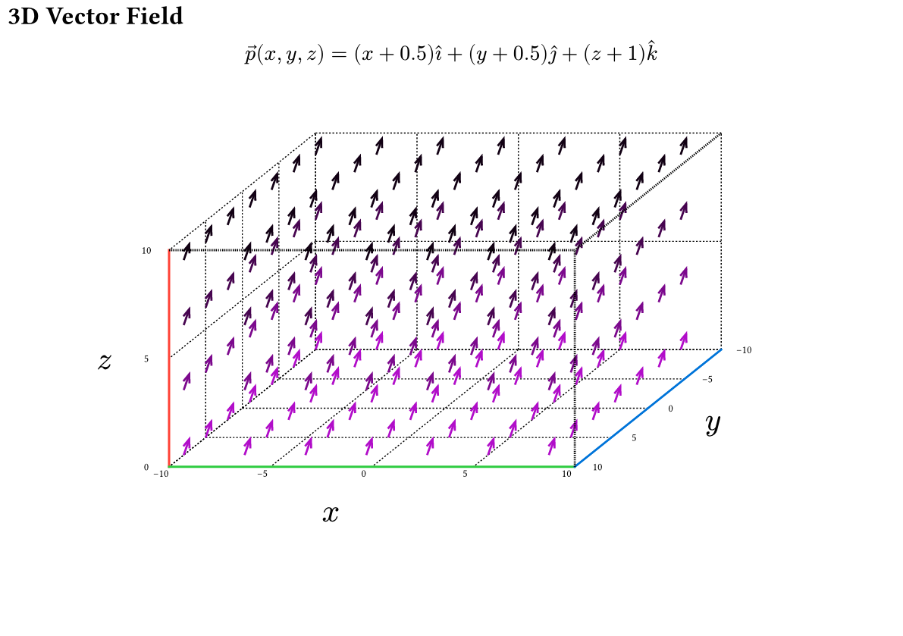
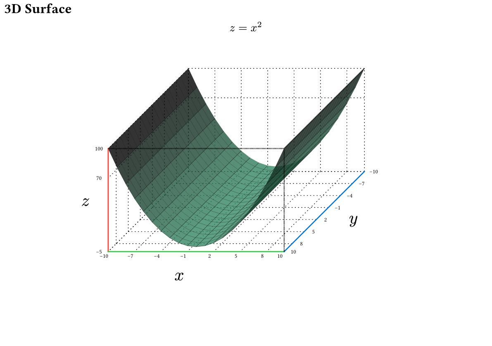
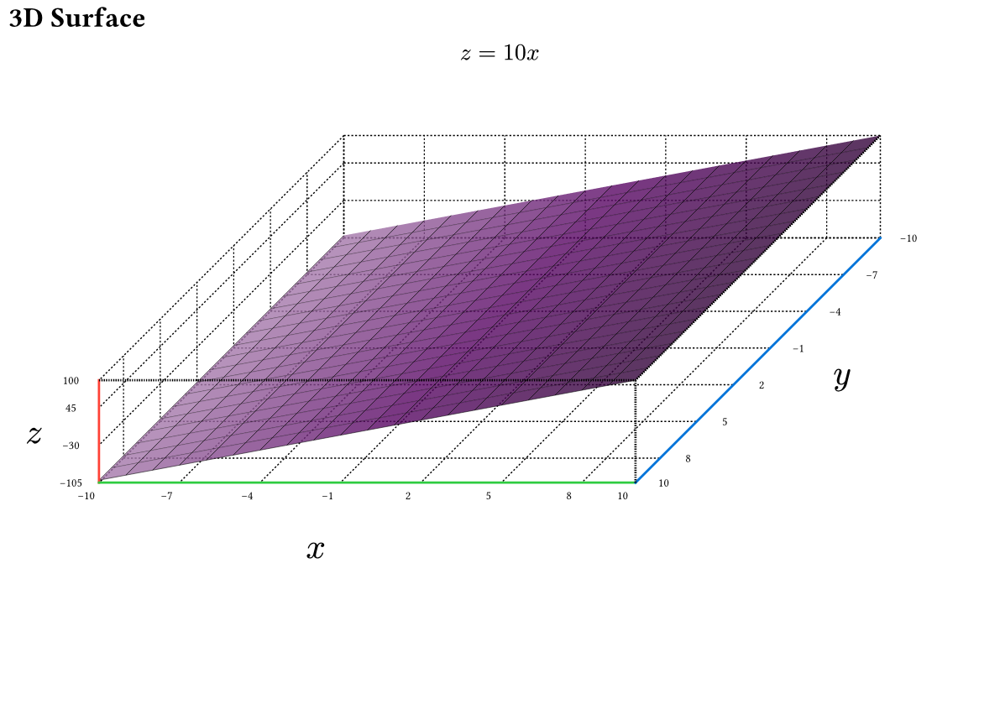

# The `plotsy-3d` Package
<div align="center">Version 0.1.0</div>


**plotsy-3d** is a [Typst](https://github.com/typst/typst) package for rendering 3D objects built on top of [CeTZ](https://github.com/cetz-package/cetz). Similar functionality to pgfplots for LaTeX but currently less developed.


<p>
    
    
</p>

<p>
    
    
</p>

## Features:

* 3D Function plotting of the form  `z = f(x,y)`
* Parametric curve plotting of the form `x(t), y(t), z(t)`
* Parametric surface plotting of the form `x(u,v), y(u,v), z(u,v)`
* Plots autoscale with font size for consistent style

See **Usage** or `examples/examples.typ` for the code


## Future Plans (contributors welcome):
- [ ] Vector Field Plotting
- [ ] Better way to compose multiple renders onto one axis
- [ ] User Manual
- [ ] Make the code nicer

## Usage

A more in-depth description of usage. Any template arguments? A complicated example that showcases most if not all of the functions the package provides? This is also an excellent place to signpost the manual.
### Parametric Function Plotting
```typ
#import "@preview/plotsy-3d:0.1.0": *

#let xfunc(t) = 15*calc.cos(t)
#let yfunc(t) = calc.sin(t)
#let zfunc(t) = t
// for all options see the library file
#plot_3d_parametric_curve(
    xfunc,
    yfunc,
    zfunc,
    subdivisions:30, // increase subidivisions ie resolution
    scale_dim: (0.03,0.05,0.05), // dimension scaling, plots also auto scale with font size
    tdomain:(0,10), 
    axis_step: (5,5,5),
    dot_thickness: 0.05em,
    front_axis_thickness: 0.1em,
    front_axis_dot_scale: (0.04, 0.04),
    rear_axis_dot_scale: (0.08,0.08),
    rear_axis_text_size: 0.5em,
    axis_label_size: 1.5em,
    rotation_matrix: ((-2, 2, 4), (0, -1, 0)) // viewport rotation matrix from cetz
)
```

### 3D Surface Plotting
```typ
#import "@preview/plotsy-3d:0.1.0": *

#let size = 5
#let scale_factor = 0.3x
#let (xscale,yscale,zscale) = (0.3,0.3,0.05)

#let func(x,y) = y*calc.sin(x) -x*calc.cos(y) 
#let color_func(x, y, z, x_lo,x_hi,y_lo,y_hi,z_lo,z_hi) = {
  return purple.transparentize(20%).darken((z/(z_hi - z_lo)) * 300%)
}
// for all options see the library file
#plot_3d_surface(
    func,
    color_func: color_func,
    subdivisions: 5,
    subdivision_mode: "increase",
    scale_dim: (xscale*scale_factor,yscale*scale_factor, zscale*scale_factor),
    xdomain: (-size,size), // plotting domain
    ydomain:  (-size,size), // plotting domain
    pad_high: (0,0,2), // increase axis size higher than domain 
    pad_low: (0,0,0), // increase axis size lower than domain 
    axis_label_offset: (0.2,0.1,0.1), // move the x y z further from axis
    axis_text_offset: 0.045, // move the numbers further from axis
)
```

### Parametric Surface Plotting
```typ
#import "@preview/plotsy-3d:0.1.0": *

#let xfunc(u,v) = u*calc.sin(v) 
#let yfunc(u,v) = u*calc.cos(v) 
#let zfunc(u,v) = u
#let color-func(x, y, z, x_lo,x_hi,y_lo,y_hi,z_lo,z_hi) = {
  return purple.transparentize(20%).lighten((z/(z_hi - z_lo)) * 80%)

}
#let scale_factor = 0.25
#let (xscale,yscale,zscale) = (0.3,0.2,0.3)
#let scale_dim = (xscale*scale_factor,yscale*scale_factor, zscale*scale_factor)  

== Parametric Surface
$ x(u,v) = u sin(v), space y(u,v)= u cos(v), space z(u,v)= u $
#figure(
  plot-3d-parametric-surface(
    xfunc,
    yfunc,
    zfunc,
    xaxis: (-5,5), // set the minimum axis size, scales with function if needed
    yaxis: (-5,5),
    zaxis: (0,5),
    color-func: color-func,
    subdivisions:5, 
    scale_dim: scale_dim,
    udomain:(0, calc.pi+1), // note this gets truncated to an integer
    vdomain:(0, 2*calc.pi+1), // note this gets truncated to an integer
    axis_step: (5,5,5),
    dot_thickness: 0.05em,
    front_axis_thickness: 0.1em,
    front_axis_dot_scale: (0.04, 0.04),
    rear_axis_dot_scale: (0.08,0.08),
    rear_axis_text_size: 0.5em,
    axis_label_size: 1.5em,
  )
)
```
### Custom Plotting
For custom combinations of plots and lines, you can make a copy of the relevant plot function from `plotsy-3d.typ` and add multiple plots onto the same axis in the same cetz canvas using the backend render functions.

## More Examples

<p>
    
    
</p>

<p>
    
    
</p>

<p>
    
    

</p>

## Build Examples
`typst compile examples/examples.typ --root . examples/examples{p}.png`

## Star History

<a href="https://star-history.com/#misskacie/plotsy-3d&Date">
 <picture>
   <source media="(prefers-color-scheme: dark)" srcset="https://api.star-history.com/svg?repos=misskacie/plotsy-3d&type=Date&theme=dark" />
   <source media="(prefers-color-scheme: light)" srcset="https://api.star-history.com/svg?repos=misskacie/plotsy-3d&type=Date" />
   
 </picture>
</a>

## Changelog

### V0.1.0
Initial release
* 3D Function plotting of the form  `z = f(x,y)`
* Parametric curve plotting of the form `x(t), y(t), z(t)`
* Parametric function plotting of the form `x(u,v), y(u,v), z(u,v)`

